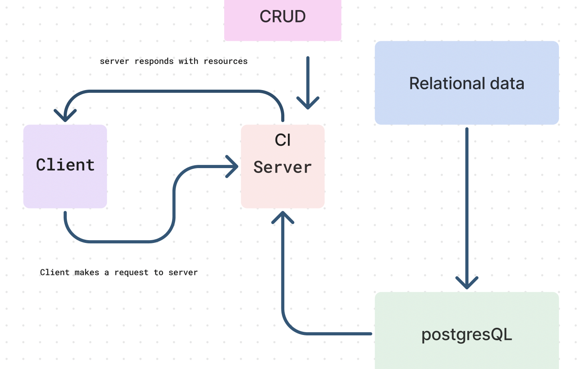

# api-server

**Author**: **Wajiha Khan**

**Version**: **2.0.0**

**Overview**:

The project involves building a RESTful API using Express.js and Sequelize ORM to perform CRUD operations on a PostgreSQL database. Sequelize models representing related data are created and exported as Node.js modules. Endpoints adhering to REST standards are implemented for each model, with CRUD operations including CREATE, READ, UPDATE, and DELETE. At least one endpoint retrieves related data from multiple tables. A Collection Class is developed to handle CRUD operations, with each method calling the appropriate Sequelize method. Error handling is integrated, and thorough testing, documentation, and potential deployment wrap up the project.

